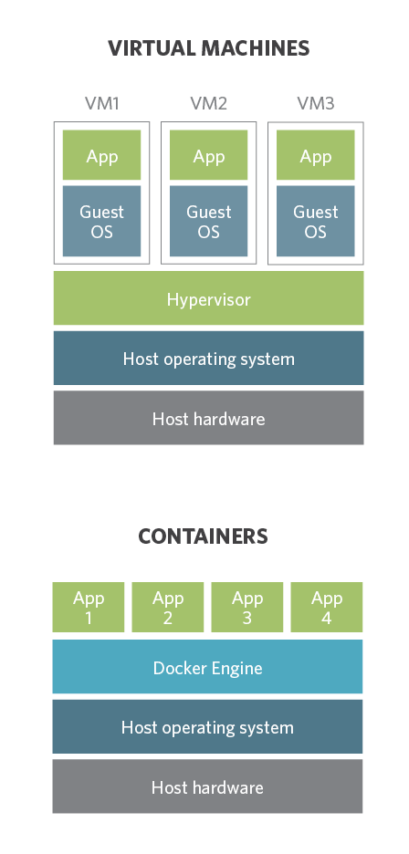

<!-- _class: lead  -->
# Vagrant
Virtuelle Maschinen einfach in einer Datei definieren


---
# Inhaltsverzeichnis

1. Was ist Vagrant?
2. Unterschied zu Containern
3. Einsatzmöglichkeiten
4. Demo
5. Fragerunde

<br />
Slides und Demo Material unter:  
https://github.com/horvaro/VagrantDemo-NoEng2020

---
# 1. Was ist Vagrant?

- Hashicorp → https://www.vagrantup.com/
- Deklarative Konfigurationsdatei für eine VM
  - OS Konfiguration
  - Softwarepakete
  - etc.
- Cross-Platform
  - Hypervisor/Provider
    - Virtualbox, Hyper-V, VMware, ...
  - Betriebssystem
    - Mac, Linux, Windows

---
# :information_source: Disclaimer für die nachfolgenden Demos

- Um Vagrant benutzen zu können benötigt man
  - Vagrant für sein Betriebssystem
    - https://www.vagrantup.com/downloads
  - Einen unterstützten Hypervisor (sog. Provider)
    - Virtualbox, Hyper-V, VMware
    - Default Provider ist Virtualbox, kann geändert werden via Umgebungsvariablen
    - https://www.vagrantup.com/docs/providers/default


---
# 1. Was ist Vagrant?
- Portable Definition einer Umgebung
```
Vagrant.configure("2") do |config|
  config.vm.box = "centos/7"
end
```
- Vagrant Box: Fertiges Image einer VM, vorbereitet für Vagrant
  - https://vagrantcloud.com/search
- Durch die Virtualisierungsebene kann jedes OS gestartet werden
  - Wie man es sich sonst auch von virtuellen Maschinen gewöhnt ist
- :warning: Bei der Suche nach "Vagrant Boxes" auf den Provider achten

---
# 2. Unterschied zu Container


* :heavy_plus_sign:
  - Mehr unterstützte Host OS
  - Grössere Auswahl von Guest OS
  - Unabhängig vom Host OS Typ
    (Windows, Linux)
* :heavy_minus_sign:
  - Container sind "lightweight"
    - Vagrant Box beinhaltet komplettes Guest OS
  - Ressourcenverteilung (RAM, Disk, CPU)
  - Container starten innerhalb von Sekunden

---
# 3. Einsatzmöglichkeiten

- Explorativ
  - Neues Betriebssystem ausprobieren
  - Applikation auf verschiedenen Betriebssystem testen
- Entwicklungsumgebung
  - Virtuelle Maschine für die Entwickler bereitstellen
  - Alle Tools werden gleich installiert
- "Wegwerf" Umgebung
  - Netzwerkscan, Security-Analyse von verdächtigen Binaries
  - Verhalten von Ziel-OS ausprobieren

---
# 4. Demo

1. Einfaches Vagrantfile
2. Startup Befehle (Installation von Software, Laden von Daten)
3. Zugänge einrichten (Shared Folder, Port-Weiterleitung)
4. Multi-Maschinen Setup (Cluster, etc.)
5. Windows Server Beispiel

---
# 4. Demo 1

<!-- Andere Provider erwähnen: VMware, Google GCE (Plugin), OpenStack ... -->
<!-- https://vagrant-lists.github.io/plugins.html -->

Einfaches Vagrantfile

```
Vagrant.configure("2") do |config|
    config.vm.box = "centos/7"

    config.vm.provider "virtualbox" do |vb|
        vb.memory = 3072
        vb.cpus = 1
    end

    config.vm.provider "hyperv" do |hv|
        hv.memory = 3072
        hv.cpus = 1
    end
end
```


---
# 4. Demo 2
<!-- Befehle anschliessend ausprobieren -->
<!-- nmap -Pn foobar,  speedtest-cli,  mvn clean install -->

Startup Befehle (Installation von Software, Laden von Daten)

```
Vagrant.configure("2") do |config|
    config.vm.box = "hashicorp/bionic64"

    config.vm.provider "virtualbox" do |vb|
        vb.memory = "3072"
    [...]

    config.vm.provision "shell", inline: <<-SHELL
        apt-get update
        apt-get install -y nmap speedtest-cli maven git default-jdk
        su - vagrant -c "git clone https://github.com/javaparser/javaparser-maven-sample.git"
    SHELL
end
```


---
# 4. Demo 3
<!-- ACHTUNG: Unbedingt auf Virtualbox Provider wechseln -->
<!-- Hyper-V: Keine Port-Forwards und keine Synced_Folders -->
<!-- -> Jedoch mit Umweg möglich -->
<!-- https://www.bookstack.cn/read/Vagrant/30c69332da128a2e.md#%C2%BB%20Common%20Issues -->
<!-- https://quotidian-ennui.github.io/blog/2017/05/22/vagrant-hyper-v-sync-folders/ -->
Zugänge einrichten (Shared Folder, Port-Weiterleitung)

```
Vagrant.configure("2") do |config|
    [...]

    config.vm.network "forwarded_port", guest: 80, host: 8080
    config.vm.network "forwarded_port", guest: 8080, host: 9999, host_ip: "127.0.0.1
    config.vm.synced_folder "C:\\_temp", "/vagrant_data"

    [...]
end
```

Port-Weiterleitung funktioniert in Hyper-V aktuell nicht.
So wie auch das korrekte Einhängen von lokalen Ordnern.


---
# 4. Demo 4: Multi-Maschinen Setup

<!-- Vagrant up dauert lange -->
<!-- Anschliessend 'vagrant ssh vm1' -->
<!-- Mit curl und lynx server gegenseitig aufrufen -->

```
$installer = <<SCRIPT
    sudo yum install -y epel-release; sudo yum install -y nginx; sudo systemctl start nginx
SCRIPT

Vagrant.configure("2") do |config|
    config.vm.provision "shell", inline: $installer

    config.vm.define "vm1" do |vm1|
        vm1.vm.box = "centos/7"
        vm1.vm.hostname = "vm1.local"
        vm1.vm.network "private_network", ip: "172.42.42.101"
        vm1.vm.provider "virtualbox" do |vb|
            [...]
        end
        config.vm.provision "shell", inline: <<-SHELL
            yum install -y nmap
        SHELL
    end 

    config.vm.define "vm2" do |vm2|
    [...]

end
```


---
# 4. Demo 5

Windows Server Beispiel

```
Vagrant.configure("2") do |config|
    config.vm.box = "gusztavvargadr/windows-server"

    [...]
end    
```

Anschliessend kann mit den folgenden Befehlen gearbeitet werden
- `vagrant rdp`
- `vagrant powershell`


---
# 5. Fragerunde


---


<br />

# &nbsp;&nbsp;&nbsp;Vielen Dank
#### &nbsp;&nbsp;&nbsp;&nbsp;&nbsp;für eure Aufmerksamkeit!